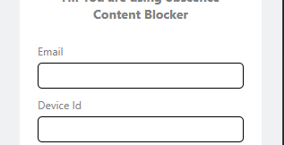
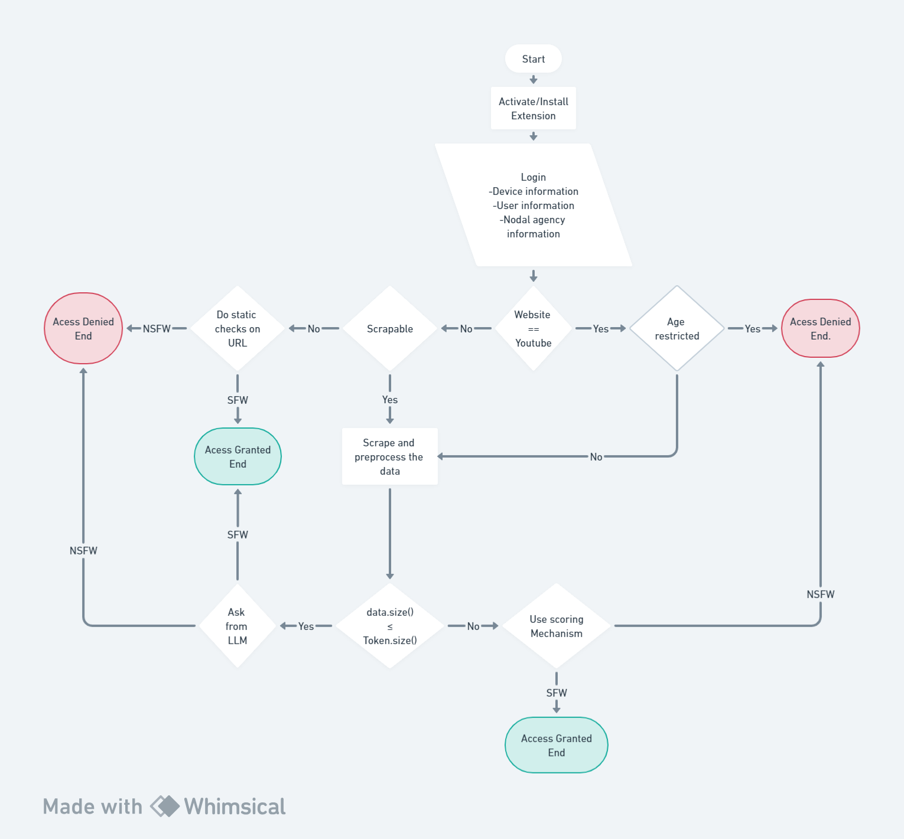

# Obscene_ContentBlocker
A small project for reckon Hackathon
# Problem statement

1. Obscene content blocker
2. **Description** Design and develop a technological solution for identifying and blocking any obscene media (image/video/audio) at the user’s end. The solution should be able to send alerts to the concerned nodal agency in case of the spread of such content. The solution may be in the form of a desktop/mobile application or a web browser plugin.

# Solution/Idea/Approach Detail

1. We will build a browser extension that will either display the content of the website or block it using the following metrics.
    1. Using the URL of the website.
        1. Check if has already been blacklisted.
        2. Monitoring and analyzing the content of the website using machine learning and data science. 
2. **Our solution is tried and tested and gives astonishing 93.88 accuracy**
3. 

# Process Flow chart

# Usecase

- Parental Control:
    
    Scenario: Parents want to ensure a safe online environment for their children.
    Use Case: The browser extension helps parents filter and block explicit content, ensuring a child-friendly browsing experience.
    

- Corporate Security:
    
    Scenario: Organizations aim to maintain a safe and secure working environment.
    Use Case: The extension helps organizations block access to inappropriate content, fostering a professional and secure workplace.
    

- Public Spaces:
    
    Scenario: Public places with shared computers (libraries, internet cafes) need to prevent access to explicit content.
    Use Case: The extension helps maintain a safe browsing environment in public spaces, adhering to community standards.
    

- Institutional Compliance:
    
    Scenario: Organizations need to comply with regulations regarding inappropriate content.
    Use Case: The extension helps organizations meet compliance standards by actively blocking and reporting explicit content.
    

- Individual User Control:
    
    Scenario: Users want to customize their online experience and avoid specific types of content.
    Use Case: The extension allows users to define their content preferences, blocking or allowing websites based on their personal choices.
    

- Customized Safe Browsing Experience:
    
    Scenario: Users prefer a tailored browsing experience with personalized content filtering.
    Use Case: The extension offers personalization options, allowing users to define specific criteria for safe or unsafe content based on their preferences.
    

# FutureScope

- **Advanced Machine Learning Models:**
    - Explore the integration of more advanced machine learning models for content classification, such as deep learning models or transformer-based models like GPT (Generative Pre-trained Transformer) for enhanced accuracy.
- **Multimedia Content Analysis:**
    - Extend the solution to include analysis of multimedia content, such as images and audio. Implementing image and audio recognition models can contribute to a more comprehensive content filtering system.
- **User Behavior Analysis:**
    - Incorporate user behavior analysis to enhance content classification. Understanding patterns in user behavior can contribute to more accurate predictions and personalized content filtering.
- **Real-time Alerts and Reporting:**
    - Implement real-time alerts for users and nodal agencies, enhancing the immediacy of response to potentially harmful content. Develop detailed reporting mechanisms for nodal agencies to facilitate timely intervention.

# Business Model Canva.

Amar can make it in PPT itself.

- Completely AI-generated. Answer
    
    Creating a detailed business model canvas requires a visual representation of key components. Below is a simplified textual representation of a business model canvas for your website identification and content blocking solution:
    
    ### Business Model Canvas
    
    **1. Customer Segments:**
    
    - Parents and guardians
    - Educational institutions
    - Corporations and workplaces
    - Public spaces with shared computers
    - Individual users concerned about online safety
    
    **2. Value Propositions:**
    
    - Enhanced online safety through content filtering
    - Personalized content control and preferences
    - Compliance with regulatory standards
    - Early detection and reporting of inappropriate content
    - Continuous learning and improvement through user feedback
    
    **3. Channels:**
    
    - Direct distribution via web browser extension stores (Chrome Web Store, Mozilla Add-ons)
    - Collaboration with educational platforms and organizations
    - Online marketing and awareness campaigns
    - Social media presence and engagement
    
    **4. Customer Relationships:**
    
    - User onboarding tutorials and guides
    - Customer support for technical assistance
    - Regular updates on new features and improvements
    - Community forums for user engagement and feedback
    
    **5. Revenue Streams:**
    
    - Freemium model with basic content blocking features available for free
    - Premium subscription for advanced features and personalization options
    - Partnerships and collaborations with educational institutions and organizations
    
    **6. Key Resources:**
    
    - Software development team for continuous improvement
    - Data scientists for machine learning model enhancement
    - Marketing and sales team for promotion
    - Customer support team for user assistance
    
    **7. Key Activities:**
    
    - Software development and continuous updates
    - Machine learning model training and improvement
    - Marketing and promotional activities
    - User feedback analysis and model fine-tuning
    
    **8. Key Partnerships:**
    
    - Educational institutions and organizations for collaborative implementations
    - Online platforms for potential integration partnerships
    - Cybersecurity firms for consultation and best practices
    
    **9. Cost Structure:**
    
    - Development and maintenance costs for the software
    - Machine learning model training and infrastructure costs
    - Marketing and promotional expenses
    - Customer support and community engagement costs
    
    **10. Channels:**
    
    - Regular communication through social media
    - Collaboration with online platforms for co-promotion
    - Educational events and workshops for user awareness
    
    This business model canvas provides a structured overview of the key components necessary for the success and sustainability of your website identification and content blocking solution. Adjustments and refinements can be made based on market feedback and changing business dynamics.